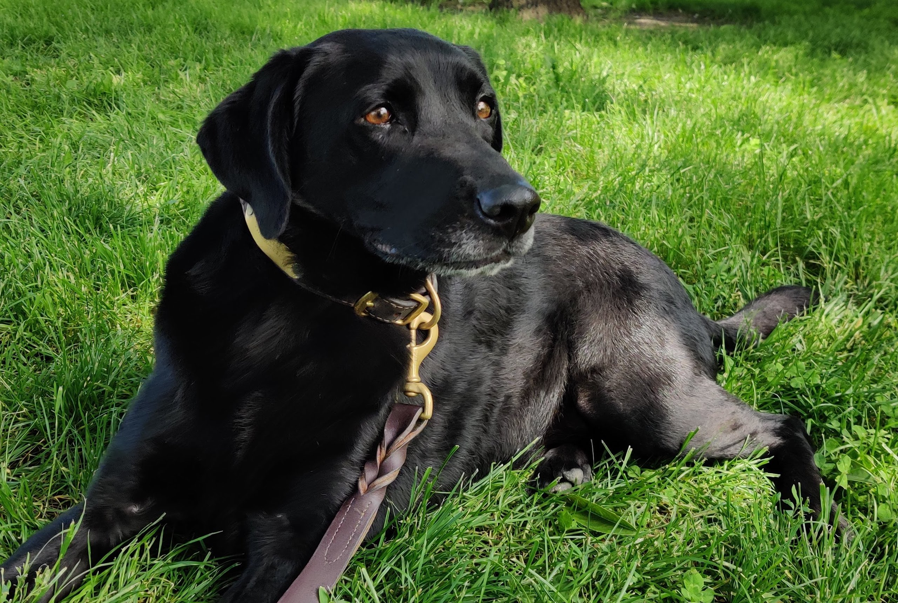

  

---

**The Dog Whisperer** harnesses the power of deep learning to make this world a better place by achieving the following:

- Recognizing dogs in images and accurately identifying their breeds.
- Recognizing humans in images and accurately identifying the dog breeds of cloest resemblance.
- Notifying users when neither a dog nor human is detected.

## Motivation

Accurately identifying dog breeds has long been a problem for human eyes and brains. The Dog Whisperer lays the algorithmic foundation for a mobile or web app that can accept a user-supplied image and provide a result instantly. In other words, the algorithm must not only be accurate but also efficient enough to be executed on a mobile or web platform.

## Libraries

The following libraries are required to execute the Dog Whisperer:

- NumPy
- glob
- Matplotlib
- OpenCV
- Scikit-learn
- Tensorflow
- Keras
- InceptionV3

## Files

`TheDogWhisperer.ipynb` outlines the step-by-step process of developing and testing the algorithm

## Results

The Dog Whisperer is capable of identifying dog breeds at a 80.0% accuracy rate. The results of its human application may not be as obvious. The feature similarities observed by the algorithm may be entirely differernt from what human eyes can detect.

## Acknowledgement

Special thanks to Udacity for providing the data and guidance.
